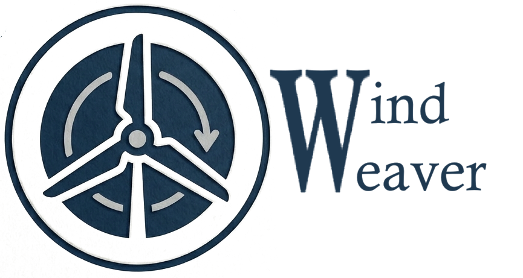
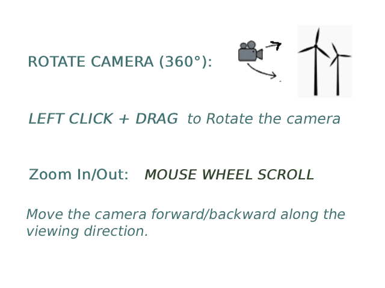

# WindWeaver

*A 3D wind farm simulator built with Three.js.*

**Play the demo here:** [(https://sapienzainteractivegraphicscourse.github.io/final-project-ctrl-wn/) \]]

WindWeaver is an interactive 3D WebGL simulator of a wind farm. It features hierarchical turbine models, a custom GPU-instanced grass shader, dynamic day/night lighting cycles, and a custom wind simulation that can toggle between global unidirectional flow and local flow guided by 3D Catmull-Rom splines.

Developed for the **Interactive Graphics Course** at **Sapienza University of Rome** by JOSE' RAUL NICOLAS PALACIO and WALTER ENRICO BRUTI.

---

---

## 🎮 User Manual & Controls

*(Above: Keyboard and Mouse interaction layout)*

### Mouse & Keyboard Controls
*   **Left Click + Drag**: Rotate the camera 360°.
*   **Mouse Wheel Scroll**: Move the camera forward/backward along the viewing direction.
*   **`F` Key**: Toggle the **Wind Vector Field** debug view on and off.

### UI Control Panel
The HUD on the left side of the screen allows you to tweak the simulation in real-time:

*   **Wind Control:**
    *   **Wind Mode**: Switch between *Global* (straight wind across the map) and *Local / Spline* (wind flows along a generated path).
    *   **Wind Intensity**: Slider to adjust the wind speed (0% to 100%). Affects turbine rotation, grass bending, and audio volume/pitch.
    *   **Global Wind Direction**: An interactive compass. Click and drag the arrow to change the global wind direction.
    *   **Regenerate Wind Spline**: Generates a new random path for the localized wind mode.
    *   **Influence Threshold**: Adjusts how far the wind spreads from the spline path.
*   **Day and Night:**
    *   **Time of Day**: Slider to manually set the time (0.0 to 24.0).
    *   **Auto Time Cycle**: Toggles the automatic day/night cycle progression.
*   **Camera Views:**
    *   Quickly jump between the *Free Orbit* camera and cinematic *Fixed Views* focused on specific turbines. Camera transitions are smoothly animated using Tween.js.
*   **Audio:**
    *   **Mute/Unmute**: Toggles environmental spatial audio (Wind, Grass rustling, Turbine mechanical sounds).

---

## ⚙️ Technical Aspects

This project was built from scratch using pure **Three.js** (WebGL wrapper) and fully satisfies the course requirements.

### Hierarchical Models & Procedural Animation
The turbine models (`.glb`) are loaded, traversed, and their hierarchy (Tower -> Hub -> Rotor) is rebuilt via code. 
*   **Rotors** spin based on the calculated aerodynamic force of the wind speed.
*   **Towers** (Yaw mechanism) smoothly rotate over time to align the hub with the current wind direction.
*   **Camera Animations** are implemented using `tween.js` for smooth cubic interpolation between viewpoints.

### Lights, Textures & Materials
The scene utilizes a Physically Based Rendering (PBR) pipeline.
*   **Textures**: Complex materials use Diffuse (Albedo), Normal, Roughness, and Metalness maps. 
*   **Lighting**: A `DirectionalLight` acts as the Sun (casting soft PCF shadows), paired with a `HemisphereLight`. A custom `ShaderMaterial` is used on the Skybox to smoothly blend between Day, Sunset, and Night cubemaps based on the time variable. Red blinking `PointLights` are dynamically activated on turbines during the night cycle.

### Custom Shaders & Optimization
*   **GPU Instancing**: The terrain is populated by 25,000 grass blades and flowers using `THREE.InstancedMesh` for maximum performance.
*   **Vertex Displacement**: The grass material's vertex shader was heavily customized to calculate wind bending and wave distortion on the GPU. Grass blades automatically orient themselves towards the camera (Billboard effect) using a custom rotation matrix injected into the shader.

### Performance Note for Dual-GPU Laptops:

The application requests the dedicated GPU via WebGL's powerPreference: "high-performance" flag. However, some browsers or OS power-saving profiles might override this and force the Integrated GPU, resulting in 15-20 fps due to the vertex instancing (30,000 grass blades).

For the best experience, please ensure hardware acceleration is enabled and the browser is allowed to use the discrete GPU.

---

## 📚 Libraries and Assets Used

### Libraries
*   **[Three.js (r128)](https://threejs.org/)**: Core 3D WebGL engine.
*   **GLTFLoader & OrbitControls**: Three.js official addons.
*   **[Tween.js (18.6.4)](https://github.com/tweenjs/tween.js/)**: Used for smooth camera transitions and UI parameter interpolation.

### External Assets (Not developed by the team)
*   **Modern Turbine Model**: Downloaded from Sketchfab / custom modeler.
*   **Old Windmill Model**: Downloaded from Sketchfab.
*   **Rock Models**: Low poly rock sets with PBR textures.
*   **Textures**: Ground, grass blades, petals, and UI icons (Compass, Logo).
*   **Audio**: Royalty-free sound effects for wind, grass, and mechanical gears.

---

